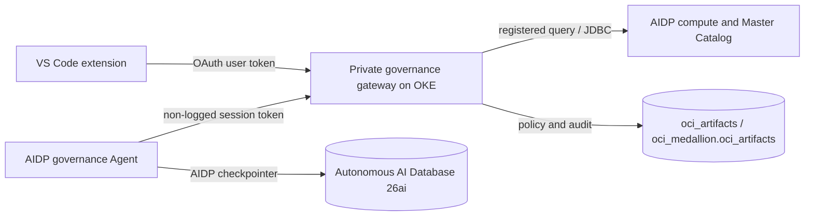

# Oracle AI Data Platform Workbench Starter Kits

Oracle AI Data Platform Workbench Starter Kits is a reusable collection of hands-on data engineering environments for Oracle AI Data Platform Workbench. It provides ready-to-run, versioned starter kits that guide participants through Landing, Bronze, Silver, and Gold data layers, workflow execution, data quality, lineage analysis, and governed AI access.

The project deploys the shared OCI infrastructure once. Participants can then register for one or more starter kits without receiving generated or user-specific copies of the source data. Every participant uses the same canonical CSV files and notebooks, which makes exercises and expected results reproducible.

Current validation target: **v2.1.21**. This release standardizes the required Medallion Architecture on five reusable Object Storage buckets, adds Laboratory and Production deployment modes, publishes the `oci_medallion` Master Catalog, and keeps the AI Data Governance Gateway optional. New-Vault deployments also wait for a stable regional KMS DNS endpoint before creating the governance key.

## What the project provides

- A shared AIDP workspace with `aidp_cluster_shared_compute` for Spark workflows, plus the private `oci_medallion` catalog.
- A shared `aidp_agent_shared_compute` AI Compute runtime for participant-specific governance Agents.
- An optional private AI Data Governance Gateway on OKE, backed by `data_governance_*` Delta tables in `oci_medallion.oci_artifacts`.
- Autonomous AI Database 26ai for the AI Compute Agent memory/checkpointer contract.
- Five required private Object Storage buckets: `oci_landing`, `oci_bronze`, `oci_silver`, `oci_gold`, and `oci_artifacts`. Each bucket can be created or connected to an existing bucket during deployment.
- A registration and administration web application hosted on an OCI Compute VM.
- Identity Domains onboarding with pending and active participant groups.
- Versioned starter kit packages containing canonical CSV files, notebooks, task dependencies, expected results, and SHA-256 hashes.
- One independent AIDP workflow per participant and starter kit.
- Per-starter-kit administration for adding, redeploying, or removing content safely.
- A Deploy Studio package for guided infrastructure deployment.

## Medallion learning path

Each starter kit follows the same progression while using a different business scenario.

| Layer | Participant activity | Typical output |
| --- | --- | --- |
| Landing | Register the canonical CSV sources in the participant area. | Source-aligned CSV tables |
| Bronze | Ingest source records and add technical metadata without changing the business meaning. | Raw governed tables |
| Silver | Validate, standardize, join, and quarantine invalid records. | Curated domain tables and quality issues |
| Gold | Build business-ready aggregations and analytical views. | Customer, service, operational, or financial insights |
| Lineage | Validate known transformations and inspect upstream, downstream, and column derivations. | Master Catalog lineage graph |

The standard starter kits contain five notebooks, one for each stage. The Telco Customer 360 Lineage starter kit uses a larger 14-task directed acyclic graph to demonstrate parallel domain processing and multi-source convergence.

## Available starter kits

| Starter kit | Package | Sources | Workflow | Main outcome |
| --- | ---: | ---: | ---: | --- |
| Banking | 2.0.0 | 4 CSV files | 5 tasks | Customer value, branch activity, transaction quality, and full medallion lineage |
| Telecommunications | 2.0.0 | 4 CSV files | 5 tasks | Subscriber usage, network-site activity, service quality, and full medallion lineage |
| Telco Customer 360 Lineage | 2.0.0 | 10 CSV files | 14 tasks | Cross-domain Customer 360, service ownership, geographic summaries, and detailed lineage |
| Retail | 2.0.0 | 4 CSV files | 5 tasks | Customer value, product sales, order quality, and full medallion lineage |
| Healthcare | 2.0.0 | 4 CSV files | 5 tasks | Patient utilization, provider activity, encounter quality, and full medallion lineage |
| Data Governance Agent | 2.0.0 | — | — | Participant-editable DAMA-DMBOK Agent for catalog/lineage evidence, effective-policy explanations, and registered governed queries |

Starter kit order, descriptions, versions, and availability come from [`apps/backend/app/labs/catalog.json`](apps/backend/app/labs/catalog.json) and each package's `lab.json`. Adding a future package does not require hard-coded changes to the registration interface.

### Banking

Banking introduces a governed pipeline for branches, customers, accounts, and transactions.

- Source rows: 20 branches, 200 customers, 320 accounts, and 4,000 transactions.
- Silver work: standardize records, preserve valid relationships, and isolate quality issues.
- Gold tables: `banking_customer_value` and `banking_branch_daily`; the final notebook validates the real pipeline lineage.
- Reproducible check: transaction amount total `600066.50`.

### Telecommunications

Telecommunications analyzes plans, network sites, subscribers, and usage events.

- Source rows: 12 plans, 30 network sites, 250 subscribers, and 6,000 usage events.
- Silver work: curate subscriber, plan, site, and usage data and record quality issues.
- Gold tables: `telecommunications_subscriber_monthly` and `telecommunications_site_daily`; the final notebook validates the real pipeline lineage.
- Reproducible check: usage charge total `15026.56`.

### Telco Customer 360 Lineage

Telco Customer 360 Lineage is the most complete lineage exercise. It combines CRM, prepaid, postpaid, product, and home-service data into a unified view of each customer and every service registered in that customer's name.

The ten sources contain 7,405 rows:

- CRM customers and addresses.
- Product catalog.
- Prepaid lines and recharges.
- Postpaid accounts, lines, and invoices.
- Home services and installations.

The workflow contains 14 tasks. Bronze processing branches by domain, Silver tasks curate each domain in parallel, and the branches converge into service ownership and Gold analytics.

Silver tables include `customer_master`, `customer_addresses`, `prepaid_service`, `postpaid_service`, `home_service`, `service_ownership`, and `quality_issues`. Gold produces:

- `customer_360`: 493 valid customers with primary address, service counts, and monthly value.
- `customer_service_portfolio`: 1,261 prepaid, postpaid, and home services with product and ownership details.
- `geographic_service_summary`: 12 regional summaries of customers, services, and monthly value.

The source data contains exactly 30 controlled quality incidents. Landing uses CSV, while Bronze, Silver, and Gold use Delta tables so AIDP can expose the complete entity and column lineage demonstrated by the starter kit.

### Retail

Retail transforms customers, products, orders, and order items into sales analytics.

- Source rows: 300 customers, 150 products, 1,200 orders, and 3,000 order items.
- Silver work: validate customer, product, order, and item relationships and quarantine quality issues.
- Gold tables: `retail_customer_value` and `retail_product_daily`; the final notebook validates the real pipeline lineage.
- Reproducible check: item quantity total `7487`.

### Healthcare

Healthcare prepares patient, provider, appointment, and encounter data for operational analysis.

- Source rows: 240 patients, 48 providers, 900 appointments, and 700 encounters.
- Silver work: standardize operational records, validate references, and isolate quality issues.
- Gold tables: `healthcare_patient_utilization` and `healthcare_provider_daily`; the final notebook validates the real pipeline lineage.
- Reproducible check: encounter cost total `557597.00`.

### Data Governance Agent

The optional Agent starter kit creates or reconciles `u101_agent_data_governance` for participant `u101`. It acts as a DAMA-DMBOK data-governance specialist: it can describe that participant's Master Catalog, inspect entity and column lineage, explain the effective policy of a registered query, and execute only a registered `query_id` through the gateway. Answers must separate observed evidence from explanation, governance implications, and recommendations or limitations. The Agent rejects arbitrary SQL and does not infer missing owners, stewards, controls, or lineage.

The package includes a versioned acceptance matrix covering catalog scope, quality, entity and column lineage, stewardship gaps, DAMA control mapping, participant isolation, unsupported certification claims, and arbitrary-SQL refusal. Candidate releases execute these questions live and retain the tool trace and response text as structured evidence without participant data from another catalog.

Each participant receives an independent Agent definition, but all participant Agents reuse `aidp_agent_shared_compute`. AIDP injects the Agent `checkpointer`; Autonomous AI Database remains deployed because AI Compute uses it for persistent Agent memory. The governance gateway never replaces that memory path. It evaluates the effective user token supplied as a required, non-logged AIDP session variable and never gives the Agent direct access to `oci_medallion.oci_artifacts`.

The package preserves `catalog_inventory` and `catalog_lineage` and adds `governance_policy_explain` and `governed_query`. A source, package, or tool-contract hash change causes one controlled redeploy; an unchanged Agent is reused. A participant deletion removes only that participant's Agent and legacy participant-scoped mirror artifacts. It does not remove the shared Autonomous deployment or shared AI Compute.

### AI Data Governance Gateway

The optional **AI Data Governance Gateway** component deploys a private, least-privilege service on OKE. It is the policy enforcement point for the VS Code SQL editor, governed notebooks, and Agent tools. Workspaces, Master Catalog browsing, clusters, notebooks, starter kits, and shared AIDP Agents remain available when the Gateway is not installed. The authoritative control plane uses `data_governance_*` Delta tables in `oci_medallion.oci_artifacts`:

- `data_governance_metadata` stores catalog classification, sensitivity, ownership, and review state.
- `data_governance_access_policy` stores `ALLOW`, `DENY`, `NULL`, `MASK`, and `TOKENIZE` rules for existing users, groups, and roles.
- `data_governance_lineage_propagation` records deterministic propagation rules and conflicts.
- `data_governance_query_registry` stores approved parameterized query definitions.
- `data_governance_token_vault` stores token references, never plaintext source values.
- `data_governance_audit` records policy changes and effective query decisions.
- `data_governance_sync_state` records versioned Master Catalog snapshots and tombstones.

`AI_DATA_PLATFORM_ADMIN` can manage policies. `AIDP_DEVELOPER` cannot read `oci_medallion.oci_artifacts`; the Permissions UI is disabled and the API returns `403`. New or unclassified columns fail closed. `SELECT *` omits denied columns, while an explicit denied reference returns `403` and names the restricted columns. Masking and tokenization happen before results, previews, logs, or Agent responses leave the gateway.



OKE uses Workload Identity for OCI access. The required `oci_artifacts` bucket centralizes governed Delta data and runtime artifacts. Each external Delta table lives under `oci_artifacts/<table-name>` and is published as `oci_medallion.oci_artifacts.data_governance_<name>`; the licensed Oracle AIDP JDBC bundle has the fixed object name `oci_artifacts/runtime/aidp-jdbc-driver.zip`. Neither artifact enters Git or Terraform state.

JDBC installation is restricted to authenticated administrators and is available through two interfaces:

- In the registration VM, open **Settings → AI Data Governance Gateway → Install JDBC Driver**. `PUT /api/admin/aidp/jdbc-driver` validates the ZIP, synchronizes the fixed Object Storage artifact, and keeps an owner-only VM copy for recovery and authorized download.
- In the VS Code extension, an administrator requests a ten-minute, exact-object write PAR from `POST /v1/admin/jdbc-driver:upload`, uploads the ZIP directly to Object Storage, and completes the operation through `POST /v1/admin/jdbc-driver:complete` with the opaque upload identifier, declared size, and SHA-256 digest.

Both paths validate size, digest or archive structure, and the presence of a JAR before the driver becomes available. The gateway revokes the PAR before reading the extension upload and deletes invalid objects. Its OKE Workload Identity can manage PARs only for the `oci_artifacts` bucket and manage only that fixed JDBC object; it cannot manage any other object in the bucket.

A separate technical JDBC API key is generated after apply, stored in OCI Vault, and limited to `ADMIN` on the `oci_artifacts` schema, `USE` on the shared cluster, and the documented `read buckets`/`inspect objects` discovery permissions on `oci_artifacts`. The personal deployment key is never mounted in pods. Public TLS and OIDC terminate at OCI API Gateway; the OKE service remains private. See [`docs/data-governance.md`](docs/data-governance.md) for the complete contract and acceptance gates.

## End-to-end user guide

### 1. Deploy the shared environment

Use OCI Deploy Studio with an immutable validated release. Deploy Studio discovers subscribed regions and compatible AIDP, Autonomous AI Database 26ai DW, and OCI Generative AI Chat capabilities before provisioning the network, private data bucket, registration VM, Identity Domains groups and policies, AIDP workspace, compute, and permissions.

For a clean `v2.1.21` validation, select **New compartment**, use the default `oracle-ai-data-platform` name or another unique name, and treat the run as an independent installation rather than an upgrade. In **Medallion Architecture**, choose **Create new bucket** or **Use existing bucket** independently for Landing, Bronze, Silver, Gold, and Artifacts. When **AI Data Governance Gateway** is selected, keep **OCI Vault mode** at **Create new Vault** for an isolated installation, or choose **Use existing Vault** and select an accessible regional `ACTIVE` `DEFAULT` Vault.

Select the deployment mode before validation:

- **Laboratory** enables the registration code and participant self-registration page.
- **Production** disables public registration and opens directly on the administrator sign-in form. The public home toggle is not shown.

After administrator sign-in, the application identifies the OCI user that created the environment so operators can confirm which principal owns the deployment.

When the deployment completes, retain these outputs:

- Application URL for participant registration.
- Administrator URL for user and starter kit management.
- AIDP Workbench URL.
- Lab access summary artifact.

See [OCI Deploy Studio compatibility](#oci-deploy-studio-compatibility) for the supported package contract and required inputs.

### 2. Create or register a participant

In **Laboratory** mode there are two onboarding paths:

1. A participant opens the application URL, enters the registration code, full name, email address, and one or more available starter kits.
2. An administrator opens the administrator URL, selects **Users**, chooses **Add user**, enters the participant details, and selects starter kits from the catalog table.

The email address is also the OCI Identity Domains username. It is never rewritten with aliases or release-specific suffixes.

In **Production** mode, public registration is disabled; administrators provision participants from the **Users** page.

Provisioning progresses through Identity, Workspace, Schemas, Content, and Permissions. The participant remains pending until every initially selected starter kit is active. The application can resume a retryable operation by its operation ID, so a browser timeout does not require creating another participant.

### 3. Activate the OCI account

The participant receives the standard OCI Identity Domains welcome email and sets a password. After activation, the participant signs in to the AIDP Workbench URL using the same email address.

Participant codes begin at `101`. The first participant receives `u101`, the next receives `u102`, and so on. A participant workspace follows this convention:

```text
/Workspace/<starter_kit>/u101_participant@example.com
```

The code is used for technical isolation; the email makes the participant folder easy for an instructor to identify.

### 4. Open and run a starter kit

In AIDP Workbench:

1. Open the starter kit folder under `/Workspace`.
2. Select the participant folder named `<participant_key>_<email>`.
3. Review the canonical source files and notebooks.
4. Open the workflow named `wf_<participant_key>_<lab_id>`.
5. Confirm that the shared Spark compute is running.
6. Run the workflow and monitor every task until it reaches a successful terminal state.
7. Review the validation task and compare the results with the expected values documented in the starter kit package.

Notebooks receive `participant_key`, `lab_id`, `workspace_root`, `bucket_name`, and `objectstorage_namespace` as AIDP task parameters. They do not contain participant-specific rendered values.

### 5. Inspect tables and lineage

All starter kits use the shared `oci_medallion` Master Catalog with governed `oci_landing`, `oci_bronze`, `oci_silver`, and `oci_gold` schemas. Every table name includes its participant key and starter kit ID, for example:

```text
u101_telco_lineage_customer_360
```

The participant receives `SELECT` only on their declared starter-kit tables. Other participants receive no table grant, while `AI_DATA_PLATFORM_ADMIN` retains administrative access. This keeps the shared catalog discoverable without exposing another participant's data.

After a successful workflow:

1. Open Master Catalog.
2. Find a Silver or Gold table for the participant.
3. Open Lineage and select both upstream and downstream directions.
4. Inspect entity-level dependencies.
5. Switch to column-level lineage to trace source columns into curated and analytical outputs.

For the Telco Customer 360 Lineage package, useful traces include CRM document to `customer_360`, prepaid or postpaid MSISDN to `customer_service_portfolio`, and customer region and monthly value to `geographic_service_summary`.

## Administrator guide

The **Users** page shows participant status, Identity status, participant code, and a summary of assigned starter kits.

Use the edit action for a participant to open the starter kit manager. From there an administrator can:

- Select an available starter kit and save to provision it.
- Refresh or redeploy one starter kit to install the current package version.
- Clear a starter kit selection to remove only that starter kit's workflow, tables, objects, workspace content, and grants.
- Delete the participant to clean up all starter kits and then remove the Identity Domains account.

At least one starter kit must remain assigned. To remove the final starter kit, delete the participant instead. Operations are serialized per participant and journaled independently per starter kit, so a pending or failed change does not make other active starter kits unavailable.

The **Settings** page is divided into three sections:

- **AI Data Platform Workbench** shows the service endpoint, Workbench URL, and platform OCID.
- **Application** shows the deployment owner and, in Laboratory mode, lets an administrator replace the registration code without displaying the current secret. Production mode does not expose registration settings.
- **AI Data Governance Gateway** shows installation and connectivity state. Only administrators can install or replace the JDBC driver; non-administrators cannot access this operation.

## Reproducibility and participant isolation

Every active package is immutable for its declared version:

- CSV and notebook bytes have declared SHA-256 hashes.
- Two participants assigned the same package receive byte-for-byte identical assets.
- Expected source counts, quality controls, business aggregations, table counts, and lineage relationships are declared in `lab.json`.
- Re-running a workflow must produce the same results.

Only technical locations and permissions differ:

```text
Workspace:      /Workspace/<starter_kit>/<participant_key>_<email>
Object Storage: <layer>/users/<participant_key>/<lab_id>/...
Table:          <participant_key>_<lab_id>_<dataset>
Workflow:       wf_<participant_key>_<lab_id>
```

## Local development and testing

### Local-only profile

The local development profile runs the same nginx, FastAPI, and React image as the OCI VM. Identity and AIDP operations use local substitutes, so this mode is suitable for UI and API development but does not validate live OCI permissions or lineage.

```powershell
Copy-Item .env.example .env.dev
docker compose -f docker/docker-compose.dev.yml up --build -d
```

Open `https://localhost:18444`. The example profile uses administrator credentials `admin` / `admin` and registration code `AIDP-2026`; change them before sharing the environment.

Stop the profile with:

```powershell
docker compose -f docker/docker-compose.dev.yml down
```

### OCI-connected local profile

Use this profile to run the application locally while connecting to an already deployed Identity Domain and AIDP environment.

```powershell
.\.venv\Scripts\python.exe .\scripts\bootstrap_local_oci_env.py --config <oci-config> --key <oci-key.pem> --access-email <deployment-email.html>
docker compose --env-file .env -f docker/docker-compose.oci-local.yml up --build --detach
```

Use the successful Deploy Studio access email for `--access-email`; the helper hashes its administrator password and registration code into the local `.env` without printing or retaining their plaintext values. Open `http://127.0.0.1:18082`. This HTTP endpoint avoids the deployed VM's self-signed certificate during local DOM-based testing. The profile binds only to localhost and is not a production deployment mode.

Stop it with:

```powershell
docker compose --env-file .env -f docker/docker-compose.oci-local.yml down
```

### Deploy Studio and local proxy lifecycle

The CloudTechNext local wrapper can automate this profile without changing the deployed OCI VM:

```powershell
Set-Location D:\dev\codex-cloudtechnext
.\scripts\start-local.ps1
```

Deploy Studio runs at `http://127.0.0.1:18080`. After an allowlisted Starter Kits deployment completes, its output marker is written atomically under `.local\<deployment-id>\`; the host-side watcher then runs this repository's bootstrap and Compose profile. The first preview uses `http://127.0.0.1:18082`, while concurrent deployment profiles receive the next available loopback port. `preview.state.json` records the exact URL.

Profiles are stable by deployment ID, so navigating away from Deploy Studio does not discard them and a retry reuses the same local directory. The generated environment and sanitized container OCI config stay inside that profile. The OCI private key stays outside `.local`, is mounted read-only from the explicitly selected `.oci` path, and is never copied into the container image or repository.

Run the wrapper with `-Force` after changing this local source tree to rebuild existing previews. The manual `bootstrap_local_oci_env.py` and Compose commands above remain available as a fallback for a single explicitly managed profile.

## Repository layout

```text
apps/backend/app/               Registration API, Identity, AIDP provisioning
apps/backend/app/labs/          Canonical starter kit catalog and packages
apps/frontend/                  Registration and administration UI
docker/                         OCI VM and local Compose profiles
scripts/                        Local bootstrap, generators, and architecture gates
terraform/                      OCI infrastructure and Deploy Studio package
terraform/hooks/post_apply.py   AIDP reconciliation and final access artifact
```

## Contributor validation

Documentation-only changes do not require runtime gates. Changes to code, packages, infrastructure, or generated assets should run the relevant checks:

```powershell
python -m pytest apps/backend/tests terraform/tests
cd apps/frontend
npm ci
npm test
npm run build
cd ../..
terraform -chdir=terraform fmt -check -recursive
terraform -chdir=terraform init -backend=false
terraform -chdir=terraform validate
terraform -chdir=terraform test
docker build -f docker/Dockerfile -t aidp-lab:test .
.\scripts\arch-postflight.ps1
```

## Troubleshooting

- **The deployed application certificate is not trusted:** the VM uses a self-signed HTTPS certificate. Use the OCI-connected local HTTP profile for browser automation, or install and trust an organization-approved certificate for normal browser access.
- **A participant remains Pending or Permissions is displayed:** refresh the user list or reopen the starter kit manager. Provisioning is resumable and continues from its operation journal.
- **A request returns 502 or 504:** the application treats transient upstream and gateway timeouts as retryable. Keep the same operation rather than creating a duplicate user or starter kit.
- **A workflow says the cluster cannot be started:** start the shared AIDP compute manually before running the workflow. A cluster explicitly stopped by a user cannot be started by the workflow.
- **Lineage is incomplete:** confirm the workflow completed, the compute configuration does not set `spark.aidp.lineage.enabled=false`, and the four medallion layers use managed catalog tables. Telco Customer 360 Lineage keeps Landing in CSV and Bronze, Silver, and Gold in Delta; managed tables preserve the governed `oci_landing -> oci_bronze -> oci_silver -> oci_gold` entity and column paths in this environment.
- **Agent remains Pending:** confirm `aidp_agent_shared_compute` is available, `aidp_cluster_shared_compute` is running with duration **Forever**, the participant catalog has all four medallion schemas, and the selected regional Chat model is still active. Agent SQL tools cannot start a stopped Spark cluster.
- **Governance deployment reports a Vault quota error:** **Create new Vault** requires an available `kms/virtual-vault-count` slot. A Vault in `PENDING_DELETION` continues to consume quota until OCI completes its mandatory 7-to-30-day deletion period. If isolation requirements allow reuse, select **Use existing Vault** and choose an accessible regional `ACTIVE` `DEFAULT` Vault instead.

## Security essentials

- Never commit OCI configuration files, private keys, passwords, registration codes, Terraform state, generated certificates, or deployment artifacts containing identifiers.
- Upload an unencrypted RSA OCI API key only through the deployment workflow. Preflight rejects unreadable, encrypted, or non-RSA keys.
- Deploy Studio does not package OCI credentials in the Terraform source or state.
- The VM receives the operator profile once through an encrypted bootstrap object, validates it, installs it with restrictive permissions, and deletes the bootstrap object.
- The Autonomous wallet is stored only on the registration VM at `/opt/aidp-lab/autonomous` with owner-only permissions and is mounted read-only into the application container. The ADMIN password stays in the post-apply process; the VM receives only a rotated `EXECUTE`-only database operator and the wallet credentials required for participant lifecycle operations.
- Autonomous AI Database remains part of every deployment that hosts AI Compute Agents: AIDP uses it for Agent memory/checkpointing. Governance policies and audit records live separately in `oci_medallion.oci_artifacts`; neither store is a fallback for the other.
- New Agent assignments do not copy Master Catalog metadata into Autonomous. The VM retains the allowlisted database operator for AI bootstrap and exact cleanup of legacy participant mirrors.
- Participants receive access only to their folder, workflow, namespaced objects, and namespaced tables.
- The data bucket uses Oracle-managed encryption and remains private.

## OCI Deploy Studio compatibility

The **v2.1.21** release is compatible with OCI Deploy Studio through [`terraform/deploy-studio.json`](terraform/deploy-studio.json), using manifest schema version 1 with optional regional-discovery and encrypted hook-file extensions.

Deploy Studio support includes:

- New or existing compartment modes.
- Guided upload of the OCI configuration and unencrypted RSA API key without packaging either credential in Terraform.
- Administrator username, hashed administrator password, and hashed registration code inputs.
- Preflight validation for compartment selection, tenancy home region, operator identity, supported VM capacity, and release source.
- Terraform plan and apply through OCI Resource Manager.
- A selectable effective region from compatible `READY` subscriptions and a dynamically discovered active Chat model in that same region.
- New or existing Autonomous AI Database 26ai Data Warehouse, with ECPU model and a default of 4 ECPUs for a new database.
- Optional private OKE governance gateway, deployed only when its checkbox is enabled and always alongside—not instead of—the Autonomous Agent-memory dependency.
- A fresh deployment in **New compartment** mode is independent; it does not update another deployed VM or retarget an OCI-connected local profile.
- Post-apply reconciliation of the AIDP workspace, catalog, `aidp_cluster_shared_compute`, AI feature enablement, Identity roles, participant application, and final access artifact. The first Agent assignment reuses the shared `aidp_agent_shared_compute` runtime.
- Structured deployment steps and outputs for the application URL, administrator URL, AIDP Workbench, bucket, workspace, compute, and identity resources.

The OCI config region is only the initial choice. The selected effective region is applied consistently to AIDP, Autonomous, Generative AI, VCN, VM, and Object Storage without rewriting the original OCI config. Deploy the immutable `v2.1.21` tag rather than an untagged development commit.

Deploy Studio currently applies the Resource Manager plan automatically after planning and does not expose a repository hook between those stages. For controlled deployments, review the generated plan or run `python terraform/release_gate.py --plan-json <plan.json>` in CI before starting the final apply.

## License

This project is licensed under the [MIT License](LICENSE).

Oracle AI Data Platform Workbench Starter Kits is an independent project and is not an official Oracle product. It is not affiliated with, endorsed by, or sponsored by Oracle Corporation. Oracle, OCI, and related marks are trademarks or registered trademarks of Oracle and/or its affiliates. Third-party trademarks, logos, service names, and assets remain the property of their respective owners.
