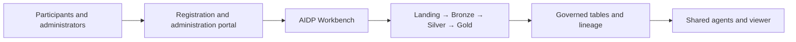

# Oracle AI Data Platform Workbench Starter Kits

Five reproducible data engineering labs and two shared modules for Oracle AI Data Platform (AIDP) Workbench. Deploy a common environment, onboard participants, and follow data from Landing through Gold with quality checks and catalog lineage.

The project includes a React administration portal, a FastAPI service, Terraform infrastructure, versioned datasets and notebooks, and native AIDP workflows and agents. God's Eye View uses Gold for analysis and Object Storage for durable controls; its local SQLite post index is rebuildable. Cloud migration and native acceptance remain pending; see [migration and recovery](docs/operations.md#migrate-gods-eye-view-controls).

## Start here

- **Deploy or run a lab:** [Getting started](docs/getting-started.md).
- **Understand the system:** [Architecture and data flows](docs/architecture.md).
- **Administer an installation:** [Operations and recovery](docs/operations.md).
- **Develop or contribute:** [Local setup and validation](docs/development.md).
- **Browse all guides:** [Documentation index](docs/README.md).

Use a validated [immutable release](https://github.com/jgangini/oci-ai-data-platform-workbench-starter-kits/releases) for deployment. A development branch is not a release; review the [current implementation limits](docs/getting-started.md#current-implementation-limits) before testing it.

## Participant starter kits

Each participant receives a separate workflow and table namespace, using the same checked and versioned source assets.

| Starter kit | What you build |
| --- | --- |
| [Banking](docs/kits/banking.md) | Customer value and branch transaction analytics |
| [Telecommunications](docs/kits/telecommunications.md) | Subscriber usage and network-site analytics |
| [Telco Customer 360 Lineage](docs/kits/telco-lineage.md) | A 14-task pipeline combining prepaid, postpaid and home services |
| [Retail](docs/kits/retail.md) | Customer value and product sales analytics |
| [Healthcare](docs/kits/healthcare.md) | Patient utilization and provider activity analytics |

## Shared global modules

Administrators manage these once for the installation, separately from participant kit selection.

| Module | Purpose |
| --- | --- |
| [AI Data Governance](docs/modules/ai-data-governance.md) | Master Catalog inventory, lineage and metadata synchronization |
| [God's Eye View](docs/modules/gods-eye-view.md) | Map-based social reports, sensor readings and evidence-grounded AI queries |

## How it fits together

```mermaid
flowchart LR
    Users[Participants and administrators] --> Portal[Registration and administration portal]
    Portal --> AIDP[AIDP Workbench]
    AIDP --> Pipeline[Landing → Bronze → Silver → Gold]
    Pipeline --> Catalog[Governed tables and lineage]
    Catalog --> Modules[Shared agents and viewer]
```

See [architecture](docs/architecture.md) for deployment boundaries, storage responsibilities and the differences between the two agents.

## Source map

| Directory | Contents |
| --- | --- |
| [`apps/backend`](apps/backend) | API, provisioning, module lifecycle and canonical [kit packages](apps/backend/app/labs) |
| [`apps/frontend`](apps/frontend) | Registration and administration UI |
| [`apps/territorial-viewer`](apps/territorial-viewer) | God's Eye View integration and its upstream asset contract |
| [`terraform`](terraform) | Deploy Studio manifest, infrastructure and post-apply hooks |
| [`docker`](docker) / [`scripts`](scripts) | Images, local profiles, release and validation tools |
| [`docs`](docs/README.md) | User guides, architecture, operations and compatibility reference |

## License

[MIT](LICENSE). Upstream components and datasets retain their own licenses; see the [viewer integration](apps/territorial-viewer/README.md). This is an independent project, not an official Oracle product. Oracle and other third-party marks belong to their respective owners.
