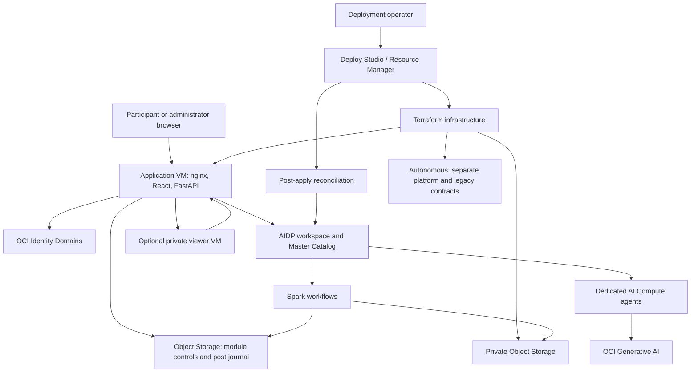
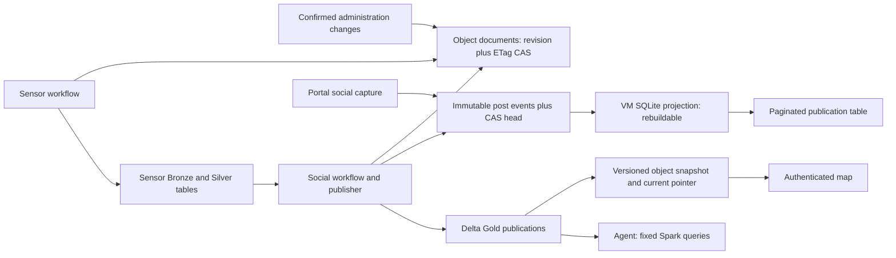
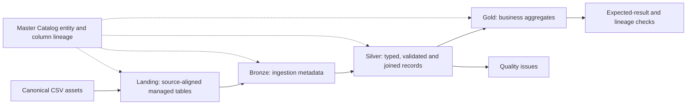

# Architecture and data flows

[Documentation](README.md) · [Getting started](getting-started.md) · [Operations](operations.md)

The portal provisions participant labs and administers two shared modules. AIDP
executes the data pipelines and agents; Master Catalog governs their tables and
access. Participant labs, Governance metadata synchronization and God's Eye View
capture/query processing have separate lifecycles.

## Deployment boundaries

The public application authenticates users and proxies the private viewer. The viewer VM is not a public administration endpoint. Its source and network rules are defined in [nginx](../docker/nginx.conf), [viewer infrastructure](../terraform/g_gods_eye_view.tf) and the [viewer integration](../apps/gods-eye-view/README.md).

Terraform creates infrastructure; [post-apply](../terraform/hooks/post_apply.py) reconciles AIDP and identity resources. The [application API](../apps/backend/app/aidp.py) subsequently manages participant and global-module lifecycle. Resource existence, successful provisioning, successful processing and successful agent inference are separate acceptance steps.

## Storage responsibilities

| Store | Responsibility | Source of truth |
| --- | --- | --- |
| Versioned kit assets | Canonical CSVs, notebook bytes, task dependencies and expected results | Checked-in `lab.json` and package assets |
| AIDP workspace | Participant content, jobs and module source files | Installed package and protected operation manifests |
| Master Catalog / Delta | Governed tables, data processing and lineage | Declared schema/table identity and successful native writes |
| Four medallion buckets | Configurable Landing, Bronze, Silver and Gold storage roles | Terraform's resolved `medallion_bucket_names` |
| `oci_artifacts` | Four Governance control tables | Governance's fixed table contract |
| Object control prefix | God's Eye View configuration, reviews, checkpoints, status and immutable post journal | Conditional object writes under `.control/gods_eye_view/` |
| VM private state | Application settings, sessions, protected files and a disposable SQLite post index | Application state is persistent; the post index rebuilds from its Object journal |
| Autonomous | Separate platform contracts and the legacy source during explicit migration | Retain until its remaining consumers are verified; new module controls do not use it |

[Bucket configuration](../terraform/f_oci_objectstorage_bucket.tf) also retains an `aidp-data-*` service/compatibility bucket resource. The `bucket_name` output used by the application resolves to the selected Landing bucket. Do not infer actual managed table locations from bucket names, legacy `01_landing/…04_gold/` helpers, or directory names. Inspect the installed catalog and table metadata.

God's Eye View uses Object Storage for operational state and Gold for analytics; neither path needs a database writer or reader credential. Existing installations must complete the [explicit migration procedure](operations.md#migrate-gods-eye-view-controls) before switching their consumers. Source availability or a successful candidate-agent query does not migrate an installation or retire its credentials. Autonomous remains part of separate platform contracts.

### God's Eye View control and read paths

Document writes reject stale revisions instead of retrying an administrator's change. Post writers append immutable events and conditionally advance the head; they do not rewrite a complete JSON index or depend on SQLite in Spark. The VM incrementally verifies and projects this journal for filtered, ordered pages. Losing that local index does not lose the journal.

Publication activation follows durable Gold and Object writes. Cleanup retains operation scope, replacement receipts and cancellation history. Object writes are individually durable: `commit` and `rollback` do not create a transaction across objects. Stop the writer before recording terminal cancellation. Source: [control store](../apps/backend/app/gods_eye_view/control_store.py), [post index](../apps/backend/app/gods_eye_view/post_index.py), [publisher](../apps/backend/app/gods_eye_view/pipeline.py).

## Participant data flow

Four kits use five serial tasks. Telco Customer 360 branches across domains and converges into shared service ownership and Gold outputs; its [guide](kits/telco-lineage.md) includes the actual dependency graph. Logical layer labels do not imply separate streaming services.

Isolation uses a participant key, a distinct workflow/folder, namespaced table names and explicit grants within a shared catalog and compute. CSVs are identical between participants; technical metadata and permissions differ. The [current layout mismatch](getting-started.md#current-implementation-limits) must be resolved before accepting a newly provisioned package execution.

## Global modules are different workloads

| Concern | AI Data Governance | God's Eye View |
| --- | --- | --- |
| Input | Master Catalog metadata | Social publications and sensor readings |
| Spark work | Continuous metadata synchronization | Social and sensor pipelines; Gold queries |
| Agent tools | Catalog inventory and lineage | Fixed incident, evidence and sensor queries |
| Presentation | Agent and administration lifecycle | Map, source administration and contextual chat |
| State | Four governance Delta tables and native agent-memory integration | Gold publications, Object controls/journal, disposable VM index and native agent context |
| Isolation | One global module, dedicated agent compute | Separate stream/query/agent resource roles in the deployment code |

Both modules use the shared OCI API credential `AidpRuntime`; supported OCI-only compatibility credentials can be adopted. Database-bearing writer credentials are not an API authentication fallback. A duplicate or invalid preferred credential fails rather than silently changing identity. Source-specific API tokens and AIDP-managed conversation memory remain separate concerns. See [Governance](modules/ai-data-governance.md) and [compatibility](reference/compatibility.md).

## Trust and AI boundaries

- Identity Domains governs OCI user identity. Portal administration also requires an application administrator session; global Governance installation verifies the selected platform administrator.
- The encrypted operator bootstrap is temporary. Private keys, wallets and runtime secrets belong in protected runtime storage or the AIDP credential store, never source files or public logs.
- Participants receive their declared kit access. Global Governance grants developers Agent `USE` and platform administrators Agent `ADMIN`; shared access is not administrator access.
- Agent tools constrain the available operations. Governance reads catalog inventory/lineage; God's Eye View uses bounded queries tied to a publication version and validates returned evidence references.
- Social text is untrusted evidence. Synthetic records must remain labelled; classification confidence, report activity and spatial correlation do not establish a real emergency or independent corroboration.
- A model response is not a deployment health check. Confirm the selected model, native tool execution, query result, provenance and authorization separately.

## Where to change the system

| Change | Primary source |
| --- | --- |
| Kit data, tasks or expected results | [`apps/backend/app/labs`](../apps/backend/app/labs) and [`lab_packs.py`](../apps/backend/app/lab_packs.py) |
| Naming and participant lifecycle | [`notebooks.py`](../apps/backend/app/notebooks.py), [`aidp.py`](../apps/backend/app/aidp.py) |
| Governance agent and synchronization | [`governance.py`](../apps/backend/app/governance.py) |
| God's Eye View pipelines and agent | [`gods_eye_view`](../apps/backend/app/gods_eye_view), [deployment hook](../terraform/hooks/gods_eye_view_bootstrap.py) |
| Portal | [`apps/frontend/src`](../apps/frontend/src) |
| Infrastructure and source publication | [`terraform`](../terraform) and [`terraform/hooks`](../terraform/hooks) |
| Release images and updater | [Release workflow](../.github/workflows/release.yml), [`vm_release_updater.py`](../scripts/vm_release_updater.py) |
