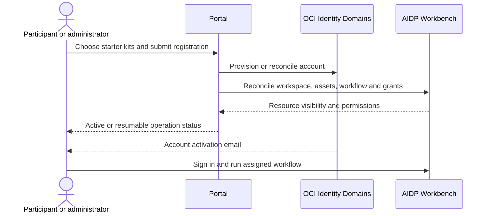

# Getting started

[Documentation](README.md) · [Architecture](architecture.md) · [Operations](operations.md)

## Current implementation limits

Check the selected release's package contracts and deployment acceptance before running a lab. A tag or passing unit tests alone does not establish native readiness.

| Area | Checked-in behavior and limitation |
| --- | --- |
| Participant layout | The provisioner supplies `/Workspace/<lab_id>/<participant_key>_<email>` and catalog `oci_medallion`. The bundled 2.0.0 notebooks still validate `/Workspace/medallon/` and `<participant_key>_aidp`. New jobs using the current provisioner can fail those guards before ingestion. This contract must be reconciled and accepted before treating new participant runs as ready. |
| God's Eye View upgrades | Standalone workflows and the Object-control runtime require an explicit migration for existing installations. Verify Gold-agent behavior, activate migrated controls, switch consumers and retire unused credentials as separate steps. Existing installations retain their legacy dependencies until those steps finish. See the [migration procedure](operations.md#migrate-gods-eye-view-controls). |
| Portal-managed installation | New environments reserve module networking and record the original Resource Manager stack. Existing bases without that receipt/topology cannot gain this capability by updating the application image alone. Mock plans and local tests do not establish live installation acceptance. |
| Historical evidence | The Telco lineage validation report describes package 1.1.2. Its results do not certify the current 2.0.0 package or a new installation. |

The layout discrepancy is visible in [naming](../apps/backend/app/notebooks.py), [job provisioning](../apps/backend/app/aidp.py), and the [Banking notebook](../apps/backend/app/labs/banking/notebooks/01_landing_banking.ipynb). Do not bypass notebook guards or substitute another participant's catalog to make a run appear successful.

## Deploy a shared environment

Use the [Deploy Studio package](../terraform/deploy-studio.json) from a validated [immutable release](https://github.com/jgangini/oci-ai-data-platform-workbench-starter-kits/releases). Local development is described separately in [Development](development.md).

Before deployment, have an OCI operator profile and RSA API key, a target compartment choice, and sufficient permissions for the resources declared in Terraform. Supply credentials through Deploy Studio's protected upload flow; they must not be committed or included in Terraform source/state. Select a subscribed region with the required AIDP, database and Chat-model capabilities offered by the form.

1. Select a new or existing compartment and the deployment mode.
2. Select or create the four medallion buckets and a separate artifacts bucket for Governance (default `oci_artifacts`). All five buckets must be distinct; existing buckets must belong to the selected compartment.
3. Choose the database and regional model offered by the deployment form. The current platform still provisions Autonomous for its existing contracts.
4. Deploy the central portal. The current form has no per-module VM or TLS checkbox: the base prepares shared private networking and configures automatic public-IP HTTPS. God's Eye View is installed later from the portal.
5. Follow preflight, plan, apply and post-apply progress. A successful Terraform apply alone does not certify workspace, model, workflow or participant readiness.
6. Retain the protected access summary and the `application_url`, `admin_url` and `aidp_workbench_url` outputs.

| Mode | Registration behavior |
| --- | --- |
| Laboratory | Participants can self-register with the instructor's code; administrators can also create users. |
| Production | Public registration is disabled; administrators provision participants from Users. |

The deployment package and discovery contract are defined in [`terraform/deploy-studio.json`](../terraform/deploy-studio.json); resolved endpoints and bucket names are defined in [`l_outputs.tf`](../terraform/l_outputs.tf).

To add God's Eye View, open **Settings → Application → Install**, review and confirm its private VM and AIDP compute requirements, then follow the installation phases. The portal applies a restricted module plan in the original stack and bootstraps its workflows and agent. Closing the dialog does not cancel installation. See [module lifecycle](operations.md#global-module-lifecycle) for retries, acceptance and legacy bases. AI Data Governance retains its separate administrator-selected installation flow.

## Register and activate a participant

1. Open the application URL. In Laboratory mode, enter a name, email, registration code and one or more starter kits. In Production mode, use **Users → Add user** as an administrator.
2. Wait for the progress dialog to finish the Identity, workspace, content and permissions phases. If a retry is offered, resume the same operation.
3. Activate the OCI Identity Domains account from its standard welcome email.
4. Sign in to the supplied AIDP Workbench URL with that email.

## Run a starter kit

After the release's layout contract has passed acceptance:

1. Open the participant's kit folder and inspect its `lab-manifest.json`, `source/` files and notebooks.
2. Open `wf_<participant_key>_<lab_id>`. Confirm the shared compute is available.
3. Run the workflow and inspect each task's outputs, including quality and lineage checks.
4. Compare results with the selected kit guide and the installed package's `lab.json`.
5. In Master Catalog, open the participant's Gold tables and inspect entity and column lineage back through the earlier layers.

| Resource | Current provisioner convention |
| --- | --- |
| Participant key | `u101`, `u102`, … |
| Workspace | `/Workspace/<lab_id>/<participant_key>_<normalized_email>` |
| Source assets | `<workspace>/source/` |
| Workflow | `wf_<participant_key>_<lab_id>` |
| Catalog and schemas | `oci_medallion.oci_landing`, `oci_bronze`, `oci_silver`, `oci_gold` |
| Table | `<participant_key>_<lab_id>_<logical_table>`; an existing lab prefix is not duplicated |

The workflow supplies `participant_key`, `lab_id`, `workspace_root`, `bucket_name`, `objectstorage_namespace` and `catalog_name`. Do not edit source CSVs to insert participant-specific values. Managed table locations are determined by the catalog; a path helper in a notebook is not proof that its writes use that path.

## Choose the next exercise

Start with [Banking](kits/banking.md), [Telecommunications](kits/telecommunications.md), [Retail](kits/retail.md) or [Healthcare](kits/healthcare.md) for a five-task medallion pipeline. Use [Telco Customer 360 Lineage](kits/telco-lineage.md) for branching and convergence across 14 tasks.

Administrators install [AI Data Governance](modules/ai-data-governance.md) and [God's Eye View](modules/gods-eye-view.md) from **Settings → Application**. These modules are shared; adding them is not a participant starter-kit assignment.
