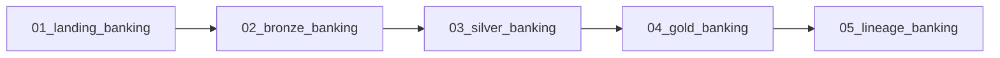

# Banking

[Documentation](../README.md) · [Getting started](../getting-started.md)

Build customer and branch activity summaries from a small banking dataset.
This participant lab demonstrates typed medallion tables, relationship checks,
quarantine and lineage using deterministic training data rather than a live bank feed.
The current [package contract](../../apps/backend/app/labs/banking/lab.json) is version `2.0.0`.

## Inputs

The checked-in [source files](../../apps/backend/app/labs/banking/source) are the actual inputs.
Provisioning copies them to the participant workspace's `source/` directory.

| CSV | Rows | Business role |
| --- | ---: | --- |
| `branches.csv` | 20 | Branch type, region and opening date |
| `customers.csv` | 200 | Customer segment, region and risk band |
| `accounts.csv` | 320 | Customer/branch ownership, balances and account type |
| `transactions.csv` | 4,000 | Account activity, time, channel, currency and amount |

The raw `transactions.amount` sum is **600,066.50**.
This is a source reconciliation value; it is not an expected Gold total after quarantine.
The manifest pins each CSV's row count and SHA-256.

## Workflow

The deployed job is `wf_<participant_key>_banking`.
The task names and dependencies below match the manifest.

1. Landing reads the four workspace CSVs, adds participant identity and writes managed Delta tables.
2. Bronze preserves source records in managed Delta tables for downstream processing.
3. Silver normalizes strings and types, keeps the newest business-key record,
   validates customer/branch/account relationships, and quarantines rejected rows.
4. Gold calculates metrics from accepted Silver records.
5. The final notebook checks all declared tables and the lineage configuration.

The [notebook sources](../../apps/backend/app/labs/banking/notebooks) contain the executable transformations.
All four catalog layers use managed Delta tables written with `saveAsTable`.

## Gold outputs

Physical table names prefix each name below with `<participant_key>_` in `<catalog_name>.oci_gold`.

| Table | Grain | Metrics |
| --- | --- | --- |
| `banking_customer_value` | Customer | Account count, current balance, recent transaction count, debit/credit amounts, last transaction |
| `banking_branch_daily` | Branch and business date | Active accounts, transaction count, total amount and average amount |

The customer transaction window is 30 days relative to the latest accepted transaction,
not the machine's current date. Credit totals include transactions marked `credit` or `refund`.
The branch summary uses all accepted transactions.

## Checks and expected results

- Landing/Bronze source counts must reconcile with the input table above.
- Silver checks required values, casts, enumerations, participant scope and foreign keys.
- Transaction amounts must be positive; duplicate business keys are quarantined after ranking by update time.
- `<participant_key>_banking_quality_issues` in `oci_silver` must contain at least one row.
- Silver row counts cannot exceed their Bronze inputs; both Gold tables must be non-empty.
- The final notebook checks all 15 declared tables are non-empty, managed and Delta.

For lineage, inspect both Gold anchors in Master Catalog with upstream/downstream depth 8.
Check entity and column paths through Landing, Bronze and Silver, including
`transactions.amount` to `banking_branch_daily.transaction_amount`.
The final notebook enables/checks lineage; its success alone does not assert every API lineage edge.

## Run as a participant

1. Follow [Getting started](../getting-started.md), including its package/provisioner compatibility notes.
2. Open your assigned Banking workflow and retain its supplied participant, workspace and catalog parameters.
3. Run the full five-task job; inspect the first failed task before rerunning it.
4. Review Silver `quality_issues`, then compare the two Gold tables and their native lineage.
5. Rerun the job with unchanged inputs: overwrite writes should keep counts stable.

Use the deployed `catalog_name`, not a copied catalog or another participant's table prefix.
For a small exploration, group the branch output by business date and compare total transaction amounts.
The [Gold notebook](../../apps/backend/app/labs/banking/notebooks/04_gold_banking.ipynb)
and [validation notebook](../../apps/backend/app/labs/banking/notebooks/05_lineage_banking.ipynb) define the result.
