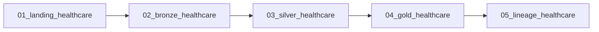

# Healthcare

[Documentation](../README.md) · [Getting started](../getting-started.md)

Build patient-utilization and provider-day summaries from appointment and encounter data.
The input is deterministic training data, not patient records from a clinical system.
This participant lab teaches data quality, temporal validation and medallion lineage.
The current [package contract](../../apps/backend/app/labs/healthcare/lab.json) is version `2.0.0`.

## Inputs

The [source files](../../apps/backend/app/labs/healthcare/source) are the actual inputs.
Provisioning copies them into the participant workspace's `source/` directory.

| CSV | Rows | Business role |
| --- | ---: | --- |
| `patients.csv` | 240 | Age band, region, coverage and risk band |
| `providers.csv` | 48 | Specialty, region, facility and capacity |
| `appointments.csv` | 900 | Booking, scheduled time, patient/provider references and status |
| `encounters.csv` | 700 | Actual encounter times, diagnosis/procedure groups and cost |

The raw `encounters.cost_amount` sum is **557,597.00**.
This reconciles the CSV fixture, not a Gold total after invalid records are removed.
Each source's hash and row count are pinned by the manifest.

## Workflow

The deployed job is `wf_<participant_key>_healthcare`.
Its five tasks have the following manifest dependencies.

1. Landing reads CSV inputs, adds participant identity and writes managed Delta tables.
2. Bronze retains the original source values in managed Delta tables.
3. Silver normalizes types, ranks duplicates, checks references and time ordering,
   and records rejected rows with reason codes.
4. Gold aggregates accepted appointments and encounters.
5. Validation checks table presence, format, storage type and the lineage setting.

The executable [notebooks](../../apps/backend/app/labs/healthcare/notebooks) define these steps.
All catalog layers use managed Delta tables; CSV is the input-file format.

## Gold outputs

Physical names prefix these names with `<participant_key>_` in `<catalog_name>.oci_gold`.

| Table | Grain | Metrics |
| --- | --- | --- |
| `healthcare_patient_utilization` | Patient | Appointments, no-shows, encounters, total cost and last encounter |
| `healthcare_provider_daily` | Provider and service date | Scheduled/completed appointments, no-show rate, encounters, average duration and cost |

Patient output starts from accepted patients and left-joins their activity.
Provider output starts from scheduled appointment dates and left-joins performed encounters.
Encounter duration is calculated from the accepted start and end timestamps in minutes.

## Checks and expected results

- Landing/Bronze row counts must match the source counts above.
- Silver validates required fields, casts, enumerations, participant scope and references.
- Encounter costs and provider daily capacity must be positive.
- Appointment and encounter end times must be strictly later than their start times.
- `<participant_key>_healthcare_quality_issues` in `oci_silver` must be non-empty.
- Both Gold tables must be non-empty; all 15 declared tables must be managed Delta.

Inspect entity and column lineage in both directions with depth 8.
Follow patient identity into `healthcare_patient_utilization` and encounter cost into
`healthcare_provider_daily.total_cost`, through the governed Landing/Bronze/Silver schemas.
Notebook success confirms the lineage setting, not every edge in the native graph.

## Run as a participant

1. Complete [Getting started](../getting-started.md) and its package/provisioner compatibility checks.
2. Open your assigned Healthcare workflow with its supplied parameters.
3. Run all five tasks, then inspect Silver `quality_issues` for time-order and reference failures.
4. Review both Gold outputs and their native lineage in Master Catalog.
5. Rerun unchanged inputs and confirm that overwrite writes keep counts stable.

Retain the deployed `catalog_name` and your participant table prefix.
As an exercise, compare provider-day no-show rates with encounter duration;
these describe different stages of the fixture's appointment-to-encounter flow.
See the [Gold notebook](../../apps/backend/app/labs/healthcare/notebooks/04_gold_healthcare.ipynb)
and [validation notebook](../../apps/backend/app/labs/healthcare/notebooks/05_lineage_healthcare.ipynb).
