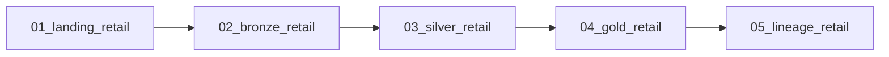

# Retail

[Documentation](../README.md) · [Getting started](../getting-started.md)

Turn customer, product and order data into customer-value and daily product summaries.
This participant lab uses deterministic training CSVs with controlled quality problems,
not a live commerce connector.
The current [package contract](../../apps/backend/app/labs/retail/lab.json) is version `2.0.0`.

## Inputs

The checked-in [source files](../../apps/backend/app/labs/retail/source) are the actual inputs.
Provisioning copies them into the participant workspace's `source/` directory.

| CSV | Rows | Business role |
| --- | ---: | --- |
| `customers.csv` | 300 | Segment, region, loyalty tier and signup date |
| `products.csv` | 150 | Category, unit cost, list price and status |
| `orders.csv` | 1,200 | Customer, channel, currency, order time and status |
| `order_items.csv` | 3,000 | Product, quantity, unit price and line discount |

The raw `order_items.quantity` sum is **7,487**.
This is a fixture check; Silver quarantine can change the quantity represented in Gold.
The manifest also pins every source file's row count and SHA-256.

## Workflow

The deployed job is `wf_<participant_key>_retail`.
The task sequence below is the actual manifest dependency chain.

1. Landing reads workspace CSVs, adds participant identity and writes managed Delta tables.
2. Bronze preserves the source records in managed Delta tables.
3. Silver normalizes and types fields, ranks duplicates, validates relationships,
   and writes rejected records to `quality_issues`.
4. Gold joins accepted items to orders and product costs, then aggregates them.
5. The final notebook verifies declared tables and the lineage setting.

See the [notebook sources](../../apps/backend/app/labs/retail/notebooks) for the transformations.
Every catalog layer is managed Delta; source files are CSV.

## Gold outputs

Physical names prefix these names with `<participant_key>_` in `<catalog_name>.oci_gold`.

| Table | Grain | Metrics |
| --- | --- | --- |
| `retail_customer_value` | Customer | Orders, units, gross/net revenue, discounts, average order value and last order |
| `retail_product_daily` | Product and order date | Units, net revenue, gross margin and refunded units |

Line gross is `quantity × unit_price`; line net subtracts the item discount.
Gross margin subtracts `quantity × unit_cost` from line net.
Refunded orders contribute to the aggregates and are also counted in `refunded_units`;
the notebook does not automatically negate their revenue.

## Checks and expected results

- Landing/Bronze row counts must reconcile with the input counts above.
- Silver checks required fields, casts, enumerations, participant identity and foreign keys.
- Product cost/list price and item quantity/unit price must be positive.
- Duplicate business keys and invalid customer/order/product references are quarantined.
- `<participant_key>_retail_quality_issues` in `oci_silver` must contain at least one row.
- Both Gold tables must be non-empty; the final notebook verifies 15 managed Delta tables.

Inspect entity and column lineage for both Gold anchors, in both directions at depth 8.
Trace customer identity into `retail_customer_value`, and item quantity through Silver
into `retail_product_daily.units`. Products and orders should participate in the corresponding paths.
The notebook checks that lineage is enabled; inspect Master Catalog for the actual graph.

## Run as a participant

1. Follow [Getting started](../getting-started.md), including the package/provisioner compatibility notes.
2. Open your Retail workflow and retain the supplied workspace, catalog and participant parameters.
3. Run all five tasks; review Silver quarantine before treating aggregates as accepted results.
4. Compare customer-level and product-day metrics, then inspect their lineage.
5. Rerun unchanged inputs and confirm stable counts under overwrite writes.

Use your deployed `catalog_name` and table prefix when querying results.
For an exercise, compare product-day net revenue, gross margin and refunded units
to explain which part of the fixture contributes to each metric.
The [Gold notebook](../../apps/backend/app/labs/retail/notebooks/04_gold_retail.ipynb)
and [validation notebook](../../apps/backend/app/labs/retail/notebooks/05_lineage_retail.ipynb) define the checks.
