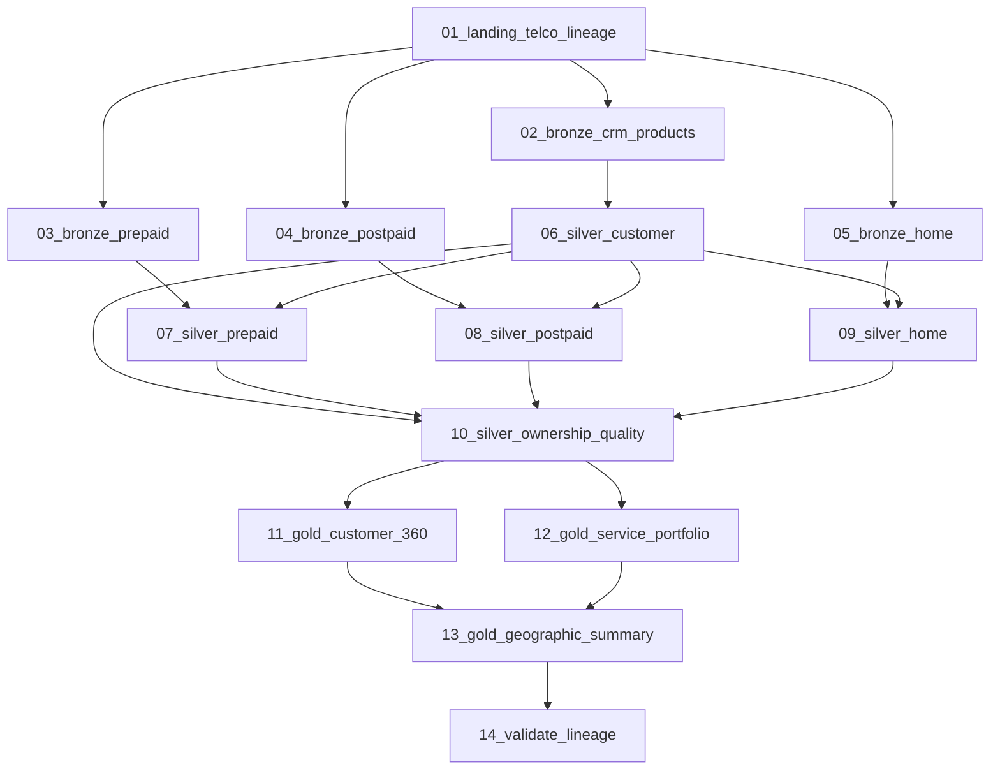

# Telco Customer 360 Lineage

[Documentation](../README.md) · [Getting started](../getting-started.md)

Unify customer identity and ownership across prepaid, postpaid and home services.
This lab emphasizes a branching workflow, exact quality outcomes and entity/column lineage.
It is distinct from the [Telecommunications usage lab](telecommunications.md).
The current [manifest](../../apps/backend/app/labs/telco_lineage/lab.json) is version `2.0.0`.

## Inputs

These deterministic training CSVs are in the [source directory](../../apps/backend/app/labs/telco_lineage/source).
There are 10 files and **7,405 source rows**; they are not live CRM or billing connectors.

| CSV | Rows | Role |
| --- | ---: | --- |
| `crm_customers.csv` | 500 | Customer identity |
| `crm_addresses.csv` | 620 | Customer addresses |
| `product_catalog.csv` | 15 | Shared product definitions |
| `prepaid_lines.csv` | 650 | Prepaid service ownership |
| `prepaid_recharges.csv` | 3,000 | Recharge amounts |
| `postpaid_accounts.csv` | 280 | Billing accounts |
| `postpaid_lines.csv` | 400 | Postpaid services |
| `postpaid_invoices.csv` | 1,500 | Invoice amounts |
| `home_services.csv` | 220 | Home-service ownership |
| `home_installations.csv` | 220 | Installation and address references |

Raw fixture sums are recharge amount **44,910.00**, invoice amount **106,800.30**
and product monthly fee **589.00**. They are source checks, not interchangeable Gold totals.

## Workflow

Job `wf_<participant_key>_telco_lineage` uses these exact tasks and dependencies:

Landing and Bronze preserve each source; Silver resolves customer identity,
addresses, product references and service ownership before the Gold branches join.
The [14 notebooks](../../apps/backend/app/labs/telco_lineage/notebooks) write **31 managed Delta tables**:
10 Landing, 10 Bronze, 8 Silver and 3 Gold. `quality_issues` is a validation sink.

## Gold outputs and exact acceptance

Tables use `<catalog_name>.oci_gold.<participant_key>_telco_lineage_<name>`.

| Gold name | Rows | Purpose |
| --- | ---: | --- |
| `customer_360` | 493 | Identity, primary address, service counts and monthly value per customer |
| `customer_service_portfolio` | 1,261 | Owned service, product and customer/location detail |
| `geographic_service_summary` | 12 | Customer/service counts and monthly value by region, province and city |

The [validation notebook](../../apps/backend/app/labs/telco_lineage/notebooks/14_validate_lineage.ipynb) asserts:

- Silver counts: 493 customers, 617 addresses, 15 products and 1,261 ownership rows.
- Services: 645 prepaid, 398 postpaid and 218 home, matching the Gold portfolio mix.
- Exactly **30** rows in Silver `quality_issues`.
- All declared tables are managed Delta; non-Landing tables have Delta history.
- Monthly value totals agree across all three Gold outputs within 0.01.

Inspect both entity and column lineage with both directions and depth 8.
Follow `prepaid_recharges.amount` through service ownership into customer and geographic monthly value.
Confirm governed `oci_landing`, `oci_bronze`, `oci_silver` and `oci_gold` paths;
the manifest rejects legacy `aidp_lab.telco_lineage.*` nodes.

## Run as a participant

1. Follow [Getting started](../getting-started.md), including package/provisioner compatibility checks.
2. Open your assigned Telco Customer 360 Lineage job and keep its supplied parameters.
3. Run the full DAG; allow the independent Bronze branches to follow the declared dependencies.
4. Review all exact counts in the validation task, then inspect lineage from each Gold anchor.
5. Rerun unchanged inputs and confirm the same counts and monthly-value reconciliation.

Use the deployed catalog parameter and participant prefix when locating tables.
The [historical validation report](../../apps/backend/app/labs/telco_lineage/VALIDATION.md)
records acceptance of version `1.1.2`, including why managed tables matter for lineage.
Its environment-specific graph counts and Landing format do not establish acceptance of `2.0.0`;
use the current manifest and executable notebook assertions for this package.
