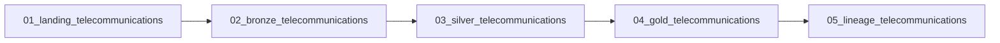

# Telecommunications

[Documentation](../README.md) · [Getting started](../getting-started.md)

Relate subscriber usage to plans and network sites, then build monthly subscriber
and daily site metrics. This participant lab uses deterministic training CSVs;
it does not connect to a live charging or network-management system.
The current [package contract](../../apps/backend/app/labs/telecommunications/lab.json) is version `2.0.0`.

## Inputs

The [source directory](../../apps/backend/app/labs/telecommunications/source) contains the actual files.
Provisioning copies them to the participant workspace's `source/` directory.

| CSV | Rows | Business role |
| --- | ---: | --- |
| `plans.csv` | 12 | Plan type, monthly fee, included usage and overage rate |
| `network_sites.csv` | 30 | Site region, technology and daily data capacity |
| `subscribers.csv` | 250 | Subscriber plan, home site, segment and activation |
| `usage_events.csv` | 6,000 | Data, voice and SMS usage with site and charge |

The raw `usage_events.charge_amount` sum is **15,026.56**.
This reconciles the fixture, not the final filtered Gold output.
Row counts and file hashes are pinned in the manifest.

## Workflow

The deployed job is `wf_<participant_key>_telecommunications`.
These are the exact manifest task names and dependencies.

1. Landing loads participant-scoped CSV records into managed Delta tables.
2. Bronze retains source values and their identity in managed Delta tables.
3. Silver casts types, normalizes strings, deduplicates business keys,
   validates relationships and separates rejected records into `quality_issues`.
4. Gold joins accepted usage with subscribers or network sites to calculate metrics.
5. Validation checks the table formats, storage types, non-empty outputs and lineage setting.

The [notebooks](../../apps/backend/app/labs/telecommunications/notebooks) are the executable reference.
All four catalog layers are managed Delta; the input files themselves are CSV.

## Gold outputs

Physical names prefix these table names with `<participant_key>_` in `<catalog_name>.oci_gold`.

| Table | Grain | Metrics |
| --- | --- | --- |
| `telecommunications_subscriber_monthly` | Subscriber, plan and month | Data MB, voice minutes, SMS count, usage charge and overage flag |
| `telecommunications_site_daily` | Site and event date | Unique subscribers, data MB, voice minutes and utilization percentage |

`overage_flag` means the aggregated `usage_charge` is greater than zero.
It does not recompute a bill using plan allowances or the overage-rate field.
Site utilization is data MB divided by daily site capacity, multiplied by 100 and rounded.

## Checks and expected results

- Landing/Bronze counts must reconcile with all four source counts.
- Silver validates required values, data types, enumerations, keys and participant scope.
- Site capacity and usage values must be positive.
- Invalid references and duplicate business keys are quarantined.
- `<participant_key>_telecommunications_quality_issues` in `oci_silver` must be non-empty.
- Both Gold outputs must be non-empty; all 15 declared tables must be managed Delta.

Inspect native lineage for both Gold anchors at entity and column level,
with both directions and depth 8. Follow subscriber identity into the monthly table
and `usage_events.usage_value` into `telecommunications_site_daily.data_mb`.
The final notebook checks lineage is enabled; graph coverage is a separate Master Catalog check.

## Run as a participant

1. Complete [Getting started](../getting-started.md) and read its package/provisioner compatibility notes.
2. Open your assigned Telecommunications workflow with its supplied parameters.
3. Run the complete five-task job in its declared order.
4. Inspect Silver quarantine reasons before comparing subscriber and site metrics.
5. Rerun with unchanged inputs and confirm that overwrite writes keep counts stable.

Keep your deployed `catalog_name` and participant table prefix when exploring the results.
A useful exercise is to compare site utilization by event date and identify which sites
have the largest data volume in this fixture.
See the [Gold notebook](../../apps/backend/app/labs/telecommunications/notebooks/04_gold_telecommunications.ipynb)
and [validation notebook](../../apps/backend/app/labs/telecommunications/notebooks/05_lineage_telecommunications.ipynb).
