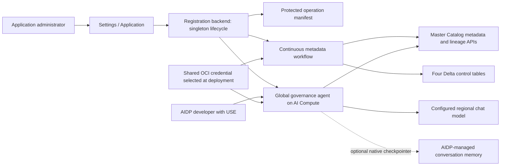
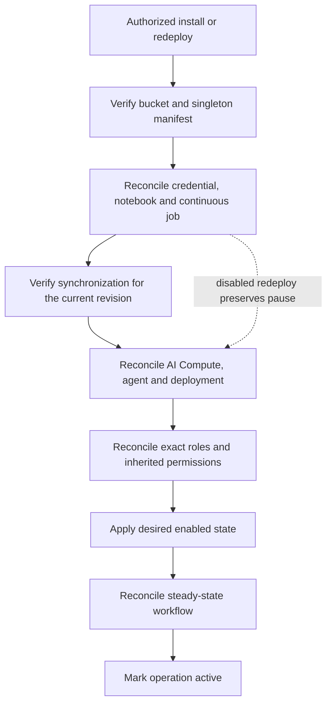

# AI Data Governance

AI Data Governance is a shared AIDP module for discovering catalog metadata and explaining entity or column lineage using DAMA-DMBOK concepts.
It combines a read-only conversational agent with a continuous metadata synchronization workflow.
This guide describes the implementation; installation and runtime acceptance must be verified in the target environment.
Start with [Getting started](../getting-started.md), [Architecture](../architecture.md), and [Operations](../operations.md).

## Scope and intended use

- One global installation serves AIDP developers in both laboratory and production modes.
- It is separate from participant starter kits: registration does not install a private copy or grant module administration.
- The agent reads metadata from active Master Catalog catalogs visible to the configured OCI identity.
- Both tools exclude `oci_medallion.oci_artifacts`, including control-schema nodes and links in lineage responses.
- The package, catalog entry and agent identifier are `ai_data_governance`; the displayed name is **AI Data Governance**. Upgrades adopt the existing global installation rather than create another agent for its old identifier.

The two tools are `catalog_inventory` and `catalog_lineage`.
Inventory can filter catalog, schema, table, or column metadata; lineage requires a uniquely resolved table and supports `ENTITY` or `COLUMN` detail.
The agent does not execute arbitrary SQL, change access mappings, inspect business rows, or certify regulatory compliance.
Its response structure separates **Evidence**, **Explanation**, **Governance implication**, and **Recommendation or limitation**.
Catalog `timeUpdated` describes metadata changes, not data freshness; missing ownership or lineage remains an evidence limitation.

## Architecture

The workflow runs on the shared Spark compute; the agent has a dedicated AI Compute.
Agent tools query Master Catalog directly rather than reading the synchronized Delta tables.
The four tables provide durable metadata, configuration, mappings, and synchronization status.
The protected workspace manifest records lifecycle progress separately so an interrupted operation can resume.

The generated agent consumes the AIDP-injected `checkpointer` when available.
If it is absent, or graph initialization with it fails, the implementation creates a stateless graph and logs the initialization failure.
Consequently, a successful answer alone does not prove persistent memory or an Autonomous-backed conversation store.
Validate the platform memory configuration and a same-session follow-up if persistent conversations are required; Delta metadata is never used as a memory substitute.

## Prerequisites and installation

Configure the AIDP workspace, shared Spark compute, Object Storage namespace, fixed artifacts bucket, and operator identity through the deployment.
The backend also needs the intended regional model ID in `AGENT_MODEL_ID`; the module does not select a different model when reusing credentials.
Its generated requirements file relies on AIDP-provided `aidputils`, OCI runtime libraries, and LangGraph; the agent also uses the native GenAI toolkit, LangChain messages/tools, and `requests`.
The synchronization notebook requires the native Spark, Delta, and notebook utility environment.

1. Sign in to the registration application as an application administrator.
2. Open **Settings → Application → AI Data Governance → Deploy / Redeploy**.
3. Select an existing user verified as an `AI_DATA_PLATFORM_ADMIN`.
4. Install the module, or redeploy the existing installation, using the dialog's operation status.
5. Wait for the operation to reach `active`; verify the workflow, agent deployment, and a fresh synchronization result.

The application administrator session and the selected user's AIDP administrator membership are separate checks.
Selecting another user does not create a new installation: the backend reconciles the same global resources.
Concurrent installs reuse the current installation operation; failed operations resume with their original `operation_id`.
An HTTP `202` response means reconciliation remains pending, not that the module is ready.

An initial installation creates the configuration row disabled and enables it only after synchronization, deployment, and permission reconciliation.
A redeploy preserves the previous enabled state, including an externally disabled module.

## Shared OCI identity and authorization

The shared selector checks these credential names in order:

| Priority | Name | Purpose |
| --- | --- | --- |
| 1 | `AidpRuntime` | Canonical shared OCI API identity. |
| 2 | `AidpDataGovernanceExtension` | Existing Governance installation compatibility. |

The first existing, non-deleted match must be unique, `ACTIVE`, and `SECRET_TOKEN`, with a resource identifier.
A duplicate, wrong type, or inactive preferred credential stops reconciliation; it does not silently select another identity.
Governance creates `AidpRuntime` only when all recognized names are absent and never updates an existing credential's secret values.
The selected name and operator identity digest are rendered into the runtime configuration.
Both generated runtimes check region and the tenancy/user/fingerprint digest before reading the private key.
The shared resolver accepts OCI-only credentials; combined database writer credentials are not an API authentication fallback.
OCI API authentication, legacy database migration and AIDP-managed memory are distinct concerns. God's Eye View uses the same OCI-only identity for its Object Storage control path; existing installations must complete the [explicit migration](../operations.md#migrate-gods-eye-view-controls) before retiring their database dependencies.

| Principal or resource | Implemented permission boundary |
| --- | --- |
| `AIDP_DEVELOPER` | `USE` on the global agent. |
| `AI_DATA_PLATFORM_ADMIN` | `ADMIN` on the agent and protected module content. |
| Participant | No module `MANAGE`/`ADMIN` grant or direct dedicated AI Compute grant. |
| Shared workspace ancestors | Conflicting inherited editor grants cause reconciliation to fail closed. |

This is a global metadata service, not a per-caller catalog authorization proxy.
Invocation permission does not make the shared OCI identity impersonate the caller.
The Delta access-policy table records mappings; neither synchronization nor the agent translates those rows into IAM grants or enforces them on arbitrary queries.

## Delta storage and synchronization

The fixed bucket is `oci_artifacts`; the logical schema is `oci_medallion.oci_artifacts`.
Each table uses `oci://oci_artifacts@<namespace>/oci_artifacts/<table>`.

| Table | Stored contract |
| --- | --- |
| `data_governance_config` | One module row; schema version, binary `enabled`, update timestamp and actor. |
| `data_governance_metadata` | Stable object identity, catalog/schema/table/column metadata, fingerprints, source version, identity status and soft-delete timestamps. |
| `data_governance_access_policy` | Explicit group/column mappings with `has_access` as `0` or `1` and audit fields. |
| `data_governance_sync_state` | Source snapshot hash/version, status, observed/change counts, start/last-success timestamps and sanitized error code. |

`wf_ai_data_governance_metadata_sync` is a native continuous job with `maxConcurrentRuns=1` and task retries disabled.
Each notebook execution scans active catalogs with bounded pagination, resolves column identities, and hashes the observed metadata.
An unchanged successful snapshot skips the metadata MERGE; a changed one upserts observed objects and soft-deletes missing columns.
Synchronization does not modify access-policy rows.
An unambiguous rename can retain its object ID; an ambiguous identity receives a new ID rather than inheriting a mapping accidentally.
The execution waits for any remainder of a 30-second cycle; a slower cycle completes before the next starts.
This is a minimum cycle duration, not a promise of 30-second freshness or an overlapping timer.
When disabled, the notebook records `DISABLED`; an externally disabled steady-state configuration also pauses the continuous job.

## Lifecycle and preservation

Redeploy reconciles generated content, workflow, agent deployment, compute, and permissions while retaining the four tables and their records.
Delete is different: it disables synchronization, pauses the workflow, removes module-owned resources, then removes the four tables and their exact storage prefixes.
The protected manifest is removed last so failures remain resumable.
Deletion retains shared OCI credentials, the artifacts bucket and schema, shared Spark compute, the Autonomous database, and unrelated starter kits.
It must not be used as a repair shortcut when governance mappings or metadata history must be preserved.

## Validation and troubleshooting

Use [Operations](../operations.md) for deployment checks; do not treat another module's successful model call as Governance acceptance.
Verify `GET /api/admin/modules`, the current agent deployment, current-revision sync success, and exact role grants.
Exercise inventory, one uniquely scoped lineage request, excluded control-schema access, and an unsupported SQL request.
For memory, test an explicit same-session follow-up separately from the first answer.

| Example question | Acceptance evidence |
| --- | --- |
| Which active catalogs and schemas are available? | `catalog_inventory` returns observed metadata and excludes the module's control schema. |
| Where does `customer_id` exist, and what is its data type? | Catalog, schema, table and column identify each match; absent descriptions remain absent. |
| Trace the column lineage of `customer_id` in this table. | Use a fully qualified table that exists; `catalog_lineage` reports observed `COLUMN` links or their absence. |
| Execute `DROP TABLE customer_360`. | The agent refuses; neither tool executes arbitrary SQL. |

| Observation | Check first |
| --- | --- |
| `401` or `403` | Application admin session and selected user's platform-admin membership. |
| Pending operation / HTTP `202` | Reported phase, operation ID, native resource state, and current-revision run; resume the same operation. |
| Credential failure | Preferred name, uniqueness/type/state, region and identity digest; do not rotate or overwrite automatically. |
| Missing metadata or ambiguous lineage | Catalog visibility/state, exact catalog/schema/table selection, pagination and control-schema exclusion. |
| Sync `ERROR` or stale `last_success_at` | Native task logs and sanitized sync error code; inspect before retrying or deleting state. |
| Agent answers but loses context | Availability and initialization of the native checkpointer; stateless fallback is supported. |

## Source and executable contracts

- [Module manifest and evaluation cases](../../apps/backend/app/labs/ai_data_governance/lab.json).
- [Agent, sync notebook and identity rules](../../apps/backend/app/governance.py).
- [Lifecycle, permissions and resource reconciliation](../../apps/backend/app/aidp.py) and [authenticated API routes](../../apps/backend/app/main.py).
- [Shared credential selection](../../apps/backend/app/gods_eye_view/runtime_secrets.py) and [deployment reuse](../../terraform/hooks/gods_eye_view_bootstrap.py).
- [Settings and module dialog](../../apps/frontend/src/App.tsx).
- [Generated-runtime tests](../../apps/backend/tests/test_governance.py) and [lifecycle/RBAC tests](../../apps/backend/tests/test_governance_lifecycle.py).
