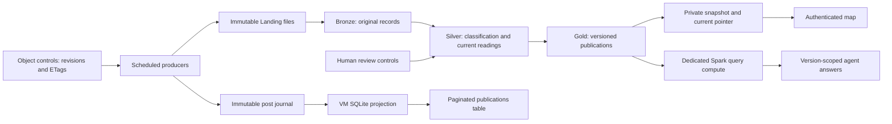

# God's Eye View · Custom layers

[Documentation](../README.md) · [Architecture](../architecture.md) · [Operations](../operations.md) · [Compatibility](../reference/compatibility.md)

God's Eye View combines social reports, sensor readings, source evidence and human review on a shared map. It helps operators examine what was reported and what needs verification. A marker, model answer or synthetic photograph is not proof of a real emergency.

Administrators configure this shared module through **Settings → Application → God's Eye View · Custom layers**, at `/admin/gods-eye-view`. The authenticated viewer opens at `/gods-eye-view/`; viewing and source administration are separate permissions.

## Implementation and deployment contract

The new implementation uses readable standalone Python workflows, Gold analytical queries and Object Storage operational controls. It does not require a database writer/reader credential for these paths. The VM's SQLite post index is a disposable projection of the Object journal, not another authoritative store.

Existing installations can still run older jobs and credentials. Follow the [explicit migration procedure](../operations.md#migrate-gods-eye-view-controls) and record acceptance for the deployed revision. A successful candidate-agent conversation does not switch the portal's agent pointer or migrate operational state; an active deployment alone does not permit deleting a dependency.

## Install the shared module

New Deploy Studio bases prepare the HTTPS portal and shared networking; they do not create the viewer VM by default. From **Settings → Application**, select its install icon, choose **Install module** and confirm the private VM, separate social/sensor/query computes, agent compute and their running costs. Existing network and shared credentials are reused.

The installer plans and applies only its allowed resources in the original Resource Manager stack, then runs AIDP bootstrap and native readiness checks. Progress shows actual phases using the registration dialog design. Closing it does not cancel work; reopening recovers status. **Resume installation** continues a stopped worker's operation, **Retry installation** requires renewed confirmation after failure, and **Verify installation** checks a ready installation without creating resources again.

Installation receipts and job tracking live in the selected artifacts bucket; data controls and publication history remain in Gold. Existing bases without the reserved network and receipt use their compatibility path, not an automatic infrastructure migration. See [operations](../operations.md#global-module-lifecycle) for the plan boundary, failure checks and current registry scope. Source: [installer](../../apps/backend/app/gods_eye_view/installation.py), [dialog](../../apps/frontend/src/GodsEyeViewModuleManager.tsx).

## Administration

| Action | Effect |
| --- | --- |
| Install / retry / resume | Confirms resource creation or recovery, reuses the same stack and tracked operation, and verifies native readiness. Conversation acceptance is separate. |
| Save Name | Confirms viewer name/description; blank fields restore defaults. Reload the viewer after saving. |
| Save source / sensor settings | Writes a revision-checked configuration without starting capture. |
| Test | Checks configuration without creating Landing data. |
| Run now | Activates the selected producer, respecting its schedule and remaining Synthetic input. |
| Pause | Stops new capture while retaining data/checkpoints; it does not stop compute. |
| Save schedule | Confirms scope, start, browser time zone and interval; paused/completed sources stay stopped. |
| Delete Synthetic data | Confirms scope and starts a durable cleanup operation. |

A stale configuration revision returns a conflict and requires reloading. Native verification requires healthy persistent tasks; bootstrap reconciles the managed jobs rather than creating unrelated replacements. See [module lifecycle](../../apps/backend/app/gods_eye_view/module.py) and [source controls](../../apps/backend/app/gods_eye_view/cloud.py).

## Capture and schedules

Social Networks includes X, Facebook, Instagram and TikTok. Only X implements credential-backed `real` capture; the other networks use `Synthetic`. Real X requires valid API access and quota. Upstream failures stay errors, and original platform IDs deduplicate overlapping search results.

One schedule controls all four social sources. Sensors has a separate schedule for river level, rainfall, temperature, soil moisture and wind speed. Sensor capture currently supports Synthetic mode only; station count is a per-family setting with a total running limit.

Forms display the browser's time zone and store the selected start in UTC. The first schedule save requires a start; intervals range from 1 to 1440 minutes. Captures align to the scheduled slots, skip missed slots and respect a future start even after Run. Saving a schedule preserves cursors and prepared retry batches; X rate limits may postpone a capture further.

Synthetic social captures select unseen eligible corpus records in bounded batches. The corpus is finite: exhaustion survives Run, query edits and restart. A separate new run supplies new input. Durable batch journals retain exact Landing bytes across retries, while unfinished downstream work can still resume. The capture interval is not an end-to-end publication latency guarantee.

Source: [capture](../../apps/backend/app/gods_eye_view/capture.py), [sensor capture](../../apps/backend/app/gods_eye_view/sensor_capture.py), [X connector](../../apps/backend/app/gods_eye_view/x.py).

## Processing and publication

Social Landing contains UTF-8 CSV envelopes with `id` and JSON `payload`; sensors use UTF-8 NDJSON TXT files. Governed volumes and separate Spark file checkpoints support ingestion; this does not deploy OCI Streaming.

Bronze retains original records. Social enrichment is journaled per post, so recovery can finish an interrupted projection without reclassifying a completed prefix. Repeated failures retain pending work and expose a circuit state. Sensor event IDs deduplicate history; timestamp and event ID select the latest reading per station in Silver. Late readings cannot replace newer ones.

The publisher writes durable Gold and Object snapshots before advancing the current pointer. Human reviews remain separate from model classification: a review can be saved before it appears in a published version. The viewer polls capture metadata and publication revisions, then retrieves the relevant completed snapshot. A new publication does not mean the processing backlog is empty.

The agent reads four views in `oci_gold`. Its canonical query names map to the installed `territorial_incidents`, `territorial_evidence`, `territorial_sensors` and `territorial_event_posts` views; this compatibility mapping preserves existing data and consumers. Queries always use the requested `publication_version`. Older rows remain history; they are not current review state. Gold mode does not recreate Autonomous analytical copies.

Source: [pipeline](../../apps/backend/app/gods_eye_view/pipeline.py), [sensor pipeline](../../apps/backend/app/gods_eye_view/sensor_pipeline.py), [Gold reader](../../apps/backend/app/gods_eye_view/gold_reader.py).

## Durable controls and local index

Under `.control/gods_eye_view/`, `docs/` holds configuration, reviews, status and checkpoints with their revisions. Each write uses an Object Storage ETag precondition; stale administration changes return 409 instead of silently overwriting another change.

Posts are appended as immutable events under `posts/nodes/`; a conditional update advances `posts/head.json`. Spark needs no local SQLite database. The VM verifies journal hashes and ancestry and incrementally builds its SQLite projection for ordered pages. That local file can be rebuilt from the journal; deleting the journal cannot be repaired from a disposable index alone.

New installations require proof that no previous module state exists. Existing installations require the explicit migration receipt before Object controls are ready. Individual object writes are durable; `commit` and `rollback` do not provide a multi-object SQL transaction. See [control store](../../apps/backend/app/gods_eye_view/control_store.py), [post index](../../apps/backend/app/gods_eye_view/post_index.py) and [migration](../../apps/backend/app/gods_eye_view/control_migration.py).

## Workspace and compute

The stable Workspace root is `/Workspace/medallion/gods_eye_view/`:

| Path | Purpose |
| --- | --- |
| `10_bronze/social_network.py` | Self-contained social ingestion, enrichment and publication. |
| `10_bronze/sensor_stream.py` | Self-contained sensor ingestion and current-state processing. |
| `20_silver/README.md`, `30_gold/README.md` | Explain actual stages and tables. |
| `40_report/ai_gods_eye_view.py` | Standalone, version-scoped Gold agent. |
| `40_report/requirements.txt` | Agent dependencies. |
| `README.md`, `manifest.json` | Usage guidance and deployment integrity record. |

The checked-in counterparts are in [labs/gods_eye_view/notebooks](../../apps/backend/app/labs/gods_eye_view/notebooks); the [source folder](../../apps/backend/app/labs/gods_eye_view/source) contains the versioned social corpus and sensor inputs. The [module manifest](../../apps/backend/app/labs/gods_eye_view/lab.json) records runtime and input-manifest hashes.

The files contain readable logic without runtime project extraction or sibling-module discovery. Deployment reads the packaged programs and fills only `RUNTIME_CONFIG` with explicit nonsecret environment metadata. The executable body remains the same; the entire deployed file is not byte-identical because configuration differs. `python scripts/render_gods_eye_view_runtime.py --check` checks generated-source and manifest drift without rewriting files. The deployed manifest verifies configured uploads; streams do not load it to execute. Stop affected consumers before replacing a stable source path.

Jobs are `wf_ai_gods_eye_view_social_network` and `wf_ai_gods_eye_view_sensor_stream`, with task keys `social_network` and `sensor_stream`. Installers adopt recognized existing IDs rather than duplicate jobs. A native `PYTHON_TASK` receives the Workspace path in its JSON argument array. AIDP injects `aidputils`; Spark uses `SparkSession.builder.getOrCreate()`.

The agent is `ai_gods_eye_view`. Compute names follow `aidp_gods_eye_view_{social,sensor,query,agent}_compute`:

| Compute | Responsibility | Configured default |
| --- | --- | --- |
| Social | Ingest/enrich social records and publish the combined snapshot. | Spark: 2 OCPU / 16 GiB driver + one 2 OCPU / 16 GiB worker. |
| Sensor | Ingest sensor history and update current readings. | Same Spark configuration, independent job and checkpoint. |
| Query | Serve the agent's version-scoped Gold SELECTs. | Same Spark configuration, separate from writers. |
| Agent | Orchestrate tools and the configured model. | AI Compute: 1 OCPU / 16 GiB. |

These are deployment defaults, not measured optimal sizes. The Spark contract is always on; pausing capture does not stop compute. SQLTool requires Query to be active. With captures paused, no actionable backlog and no ready cleanup, idle portal ticks do not start stopped streams; explicit processing actions can wake the existing jobs. Existing resources must be checked separately for name, size and state.

See [bootstrap](../../terraform/hooks/gods_eye_view_bootstrap.py), [workflow renderer](../../terraform/hooks/gods_eye_sources.py) and [agent renderer](../../terraform/hooks/gods_eye_agent_source.py).

## Outputs and workload boundaries

Native task output prints JSON records with `workflow`, `stage` and status: runtime readiness includes the source revision, sensor Silver commits include batch ID and row count, and social Gold publication includes version, incident/evidence/sensor counts and remaining backlog. Inspect these records alongside `status_pipeline` and the current publication; a running task alone does not prove fresh data.

The current serving path builds a bounded snapshot: at most 5,000 visible social records, 25,000 sensor rows per microbatch, and 100 returned rows per Gold tool query. These bounds protect driver memory and response size; they are not a capacity claim for an unbounded production workload. Larger workloads need distributed validation and paginated serving before increasing the limits.

## Evidence and human decisions

The assistant receives the publication version and applicable filters. Its references and map actions must resolve within that version; stale context is rejected. Fixed SELECTs and validated parameters bound Gold queries. Inventory answers bind incident IDs to the same records, while selected-incident and sensor questions explain their evidence. See [agent](../../apps/backend/app/gods_eye_view/agent.py).

Ask what was reported, by whom, when, where and what still needs confirmation. “No results” applies to the selected version and filters. Draft reports are not sent automatically. Confidence, severity, activity, content diversity and human validation are different concepts; repeated photographs or multiple platforms do not prove independent corroboration.

Synthetic corpora include fictional viewpoints, copies, uncertainty and contradictions. Their images are generated attachments, not documentary proof. Classification reads text, not image pixels; attachment hashes identify copies without proving a shared incident. Evaluation labels stay outside runtime inputs.

Administrators confirm validation/rejection, notes and location overrides. A concurrent change in reviewed evidence membership returns a conflict. Validated locations must be unvalidated before editing; approximate locality anchors remain approximate. General OCI assistance and upstream voice are separate from incident evidence.

## Synthetic cleanup and cancellation

Social cleanup covers synthetic social data across all networks, regardless of table filters, and preserves sensor history. Global sensor cleanup covers all five families, preserving social records, real data and saved station locations. An older family-scoped operation retains its original scope.

New deletions and destructive retries require confirmation. Requests include `confirm: true` and a UUID operation ID; retries retain that ID and scope. Completed IDs cannot delete newer data. Progress reports durable stages/counts rather than an invented percentage; closing the dialog does not cancel execution.

Terminal cancellation is recorded only after the native writer stops. It retains partial progress, does not roll back deletion and never reports completion. Cancelled IDs cannot be retried; a new deletion needs a new confirmation and ID. Captures remain paused.

Cleanup preserves real rows in mixed files/publications and journals durable replacements before removing originals. Object mode validates the exact active receipt, scope, replacement hash and stored snapshot; a cancelled or changed journal cannot authorize a replacement. Bounded history batches retain one writer. Do not clear checkpoints to dismiss an incomplete operation.

Source: [social cleanup](../../apps/backend/app/gods_eye_view/synthetic_reset.py), [sensor cleanup](../../apps/backend/app/gods_eye_view/sensor_reset.py), [confirmation UI](../../apps/frontend/src/SyntheticDataReset.tsx).

## Security and acceptance

The public application authenticates viewer/API traffic; the viewer VM remains private. OCI private keys and source tokens stay outside browser assets and published source. `AidpRuntime` supplies OCI API access; the new module does not use database-bearing credentials as a fallback. Native AIDP conversation memory remains a separate platform service.

Local checks cover [control CAS](../../apps/backend/tests/test_gods_eye_view_control_store.py), [migration](../../apps/backend/tests/test_gods_eye_view_control_migration.py), [post indexing](../../apps/backend/tests/test_gods_eye_view_object_post_index.py), [agent grounding](../../apps/backend/tests/test_gods_eye_view_agent_tools.py), [cancelled operations](../../apps/backend/tests/test_gods_eye_view_reset_cancelled.py) and [standalone workflows](../../terraform/tests/test_gods_eye_sources.py).

Use [Development](../development.md) for reproducible checks. Local tests do not certify native permissions, model access, tool execution or conversations. Acceptance must verify actual task output and publication/evidence agreement before cutover and removal of unused credentials. See the [viewer integration](../../apps/gods-eye-view/README.md) for upstream licensing and builds.
