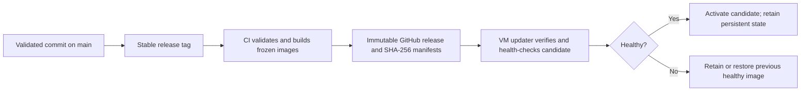

# Operations and recovery

[Documentation](README.md) · [Architecture](architecture.md) · [Compatibility](reference/compatibility.md)

## Install and identify a deployment

Follow [Getting started](getting-started.md) for deployment inputs and current limitations. A fresh compartment is a separate environment, not an upgrade of a deployed VM. Keep the selected release/commit, resolved outputs and protected access summary with the deployment's operational records.

Use **Settings → Application** to distinguish the installed application release, its source commit and bundled kit versions. A Git push updates source; it does not update a VM. A branch build marked `development` is not an immutable release.

The [Deploy Studio manifest](../terraform/deploy-studio.json) uses schema version 1. The [release gate](../terraform/release_gate.py) validates that contract. Terraform plan/apply and post-apply are separate phases; review the plan in the deployment process rather than assuming this repository inserts an approval hook between them.

## Manage users and kits

| Action in Users | Effect |
| --- | --- |
| Add user | Provision Identity access and the initial selected kits through one resumable operation. |
| Add a kit | Install its versioned assets, workflow, tables and grants for that participant. |
| Update / Redeploy | Reconcile the selected kit with the bundled version. Other kits remain assigned. |
| Remove a kit | Remove only that kit's owned workflow, tables, objects, content and grants. |
| Delete participant | Clean up assigned kits and then remove the Identity account. |

At least one kit must remain assigned; deleting the participant is the action for removing the last assignment. Provisioning and cleanup use manifests and operation IDs. Resume a failed operation from its reported state instead of creating duplicate users, jobs or folders manually.

## Update application and viewer images



The updater accepts the trusted repository's newer stable immutable releases, checks the `linux/amd64` image and checksum manifest, and validates a candidate on loopback. The application container has no Docker socket or general host-command interface. The [release workflow](../.github/workflows/release.yml) and [VM updater](../scripts/vm_release_updater.py) define this contract.

An application update changes the packages available for future installation/redeployment. It does not automatically upgrade every participant kit or migrate all live AIDP jobs. Check installed versus bundled versions and perform the appropriate explicit kit/module update. Preserve compatible viewer assets and wire paths during rolling updates; see [Compatibility](reference/compatibility.md).

After an update, verify `/api/health`, administrator access, installed release/commit, one representative kit lifecycle operation, viewer access when enabled, and native module behavior. A container health response alone does not validate Spark processing or agent inference.

## Global-module lifecycle

Manage both modules from **Settings → Application**, separately from Users:

- **AI Data Governance:** select a verified platform administrator, install/redeploy the singleton, and confirm metadata synchronization plus agent authorization. [Lifecycle and deletion scope](modules/ai-data-governance.md).
- **God's Eye View:** configure identity, source modes, schedules and providers; inspect pipeline and publication state. The viewer infrastructure must already be enabled. [Processing, cleanup and migration](modules/gods-eye-view.md).

Changing a schedule, name or registration code requires the portal's confirmation. Saving a schedule preserves paused/completed capture state. Installing a global module does not grant participants administrator rights.

## Synthetic cleanup

Synthetic deletion is a data operation, not an uninstall. Social deletion covers synthetic social data; sensor deletion covers synthetic sensor families. Confirm the displayed scope before starting. Cancelling, retrying and completing are different states: a cancelled or partial operation must never be reported as a completed reset.

When a cleanup fails or is interrupted, retry its existing operation ID and preserved journal after checking the cause. A cancelled ID is terminal and requires a newly confirmed operation. Do not clear a checkpoint or remove a dialog's state directly to force completion. The [God's Eye View guide](modules/gods-eye-view.md) explains which controls, real data and histories must survive.

## Migrate God's Eye View controls

Use this procedure when upgrading an existing module from Oracle controls to Object Storage and its immutable post journal. Fresh installations initialize the Object runtime during deployment. The [migration module](../apps/backend/app/gods_eye_view/control_migration.py) provides explicit export, staging and activation functions; it does not pause consumers, switch application configuration or remove resources automatically. Record each gate for the target installation; candidate-agent acceptance alone does not establish migration completion.

1. **Freeze and record.** Block portal writes, stop both native stream writers and verify their tasks are terminal. Record source/resource identities and preserve the current application settings, publication pointer and cancelled-reset receipt. `writers_frozen=True` asserts these checks; the function does not perform them.
2. **Export a consistent source.** Call `export_snapshot` on a fresh dedicated Oracle connection with autocommit disabled and a required `publication_sink(version, payload)` callback. It opens a read-only transaction and exports every control document and post row. Publication bodies pass to the sink one at a time; the returned snapshot retains only their canonical hashes, avoiding an in-memory copy of the full analytical history. Write each publication to a private, exclusively created JSONL file. Flush, synchronize and close that file before saving the snapshot receipt or staging anything; a failed sink/export leaves an incomplete artifact, never an accepted export. Revisions, sequences, timestamps and cancellation history are preserved. Keep both export files unchanged for retries and recovery of missing historical copies.
3. **Inspect runtime metadata.** Export allowlists runtime fields, omits obsolete writer/reader credential names and refuses unknown fields before copying them. Passwords, wallets and private keys are not migration data. Unsupported or unbackfilled post rows must be reconciled explicitly; migration does not invent revisions.
4. **Stage controls and index.** `stage_snapshot` creates destination objects only when absent and otherwise requires exact equality. A partial copy can resume from the same snapshot; conflicting content aborts instead of merging. `seed_posts` retains source sequence gaps and reserved upper bounds. Staging does not enable the runtime.
5. **Verify all analytical history.** Compare each exported version and canonical payload hash with both its Object snapshot and the actual Delta Gold row. Copy any missing historical version through a reviewed operation and recheck it. Also verify the current publication pointer and its snapshot. A Gold payload may include a redundant `id`; validate it against the row ID and `version` before removing only that field for comparison.
6. **Activate explicitly.** Supply the verified Gold version-to-hash map to `activate_snapshot`. It rechecks destination documents, the exact seeded journal, every historical Object copy and the current pointer before its final runtime ETag CAS. Only then does it set `control_migration_complete` and increment the runtime revision.
7. **Accept the new consumers.** Configure the application with `GODS_EYE_CONTROL_BUCKET` set to the verified Gold bucket, and switch the installed workflows to that Object runtime. Validate native stream output, stable paging, publication/evidence agreement and a grounded Gold-agent conversation before resuming the recorded capture configuration. Preserve job and compute IDs; changing names does not authorize duplicate resources.
8. **Retire unused dependencies.** Inspect all job, agent and library references, then remove only the old module database credentials and artifacts that have no remaining consumers. Shared platform databases, catalog connections and native agent-memory services are outside this module's cleanup scope.

The callable sequence is:

```python
import json
import os
from app.gods_eye_view.control_migration import export_snapshot, stage_snapshot, activate_snapshot

with open(private_history_path, "x", encoding="utf-8") as history:
    def save_publication(version, payload):
        json.dump({"version": version, "payload": payload}, history,
                  ensure_ascii=False, separators=(",", ":"), allow_nan=False)
        history.write("\n")
    snapshot = export_snapshot(
        legacy_connection, publication_sink=save_publication, writers_frozen=True
    )
    history.flush()
    os.fsync(history.fileno())
# Persist the small snapshot and receipt privately before staging.
staged = stage_snapshot(target_store, snapshot)
# Independently verify every exported publication and the current pointer in Gold.
activated = activate_snapshot(
    target_store, snapshot, gold_publications=verified_gold_hashes, writers_frozen=True
)
```

Oracle `LAST_NUMBER` is a reserved sequence-cache upper bound, not the last number consumed. The export records both that bound and the maximum surviving row value; the seed preserves the larger bound without calling `NEXTVAL`. Canonical hashes use UTF-8 JSON with sorted keys, compact separators and no nonfinite numbers.

Before activation, keep the original runtime selected to abandon a staged copy. After Object writers resume, an old Oracle snapshot is no longer a safe rollback: reconcile the new journal and documents first. Retain the export, verification results and original resource references under deployment access controls. A source update or local test does not prove that this procedure ran on an installation.

## Diagnose by boundary

| Symptom | First check | Avoid |
| --- | --- | --- |
| Participant stays Pending | Current operation phase, resource visibility and assigned permissions | Recreating the same account |
| `Invalid workspace_root` / `Invalid participant catalog` | Installed notebook guards versus job parameters; [known mismatch](getting-started.md#current-implementation-limits) | Disabling validation or borrowing another catalog |
| Workflow cannot start compute | Compute state and the job's exact compute reference | Starting unrelated computes |
| Missing lineage | Task completion, managed-table writes and lineage configuration | Treating notebook prose or a fabricated lineage table as evidence |
| Agent 502 / timeout | Exact deployment, compute, model availability and native tool execution/logs | Reporting an empty result or repeatedly deploying another agent |
| Capture completed but table is stale | Landing durability, ingestion/enrichment status and publication version | Regenerating already captured records |
| Reset stays incomplete | Operation ID, cancellation/error state, worker acknowledgement and replacement journal | Removing historical objects before replacement is durable |
| Control change returns 409 | Reload the current document revision and review the concurrent change | Blind retry or overwriting the current ETag |
| Post table index is unavailable | Object journal integrity and VM SQLite projection path | Deleting the authoritative journal to clear a local cache error |
| Governance stays Pending | First metadata snapshot, dedicated agent compute, model and RBAC | New global-module copies |
| Browser rejects TLS | Deployment certificate mode and certificate validity | Disabling browser security on a public environment |

Keep investigation logs private and remove tokens, credentials and personal data before sharing a report. Local fixtures validate UI/API behavior only; they do not certify OCI permissions, model access or native Spark/agent execution.

## Protect recovery material

Keep application persistent state, module operation manifests, installed release references and data/checkpoint backups under the deployment's access controls. Before a migration, record which consumers write to each store and when writes are paused. After writes resume, rollback must reconcile new state; restoring an old snapshot alone can discard later captures or cancellations.

The current repository does not provide a general cross-store disaster-recovery guarantee. Validate restoration in an isolated environment before relying on a backup procedure for production.
